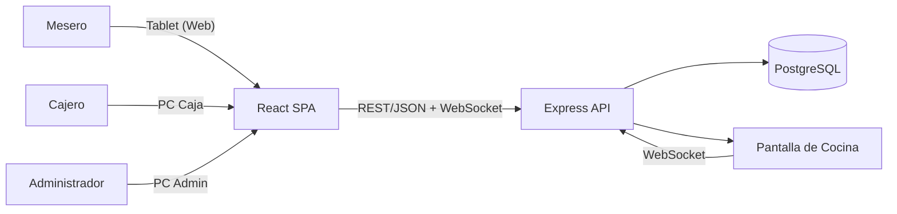
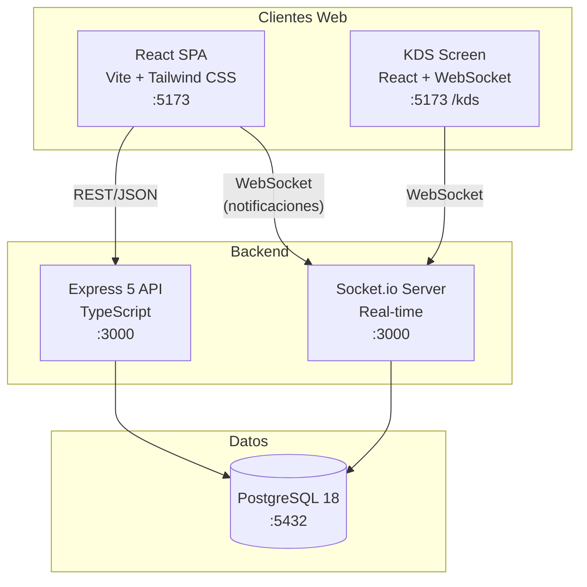
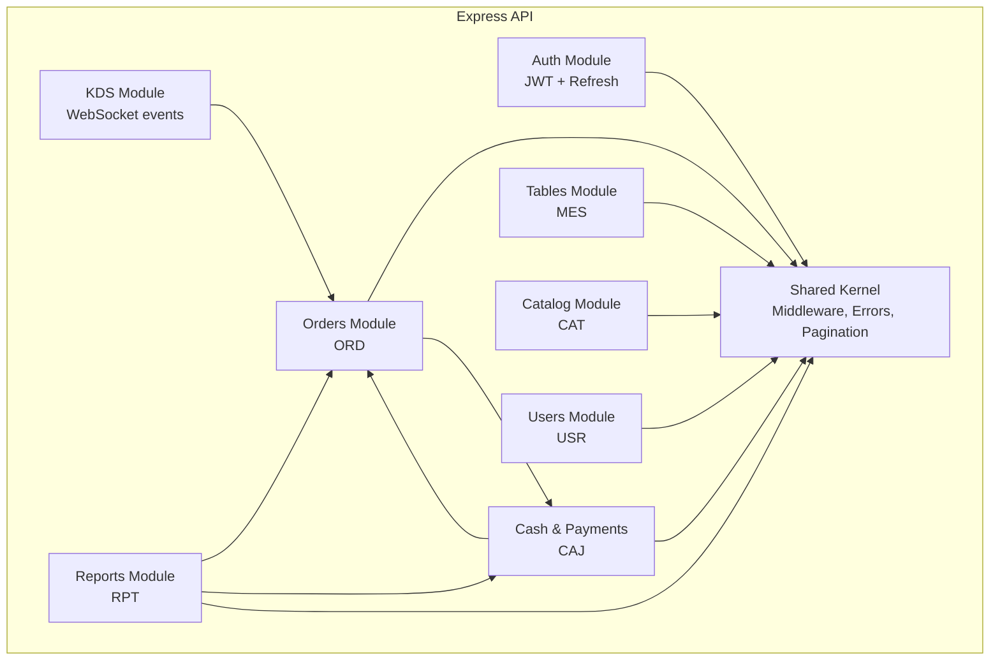
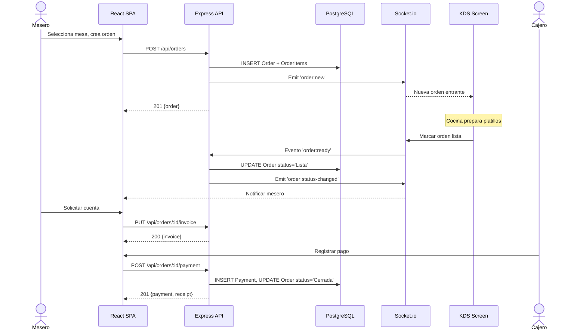

# Arquitectura del Sistema SOR

## C4 Nivel 1 -- System Context

---

## C4 Nivel 2 -- Container

---

## C4 Nivel 3 -- Component (API Express)

---

## Flujo Principal -- Sequence Diagram

---

## Modulos del Backend

### Orders Module (`src/modules/orders/`)

Proposito: Gestiona el ciclo de vida completo de ordenes de consumo.

Endpoints:
| Metodo | Ruta | Descripcion |
|--------|------|-------------|
| GET | `/api/orders` | Listar ordenes con filtros (mesa, mesero, estado) |
| POST | `/api/orders` | Crear nueva orden vinculada a mesa |
| GET | `/api/orders/:id` | Obtener detalle de orden con items y modificadores |
| PUT | `/api/orders/:id` | Agregar items o modificar orden activa |
| POST | `/api/orders/:id/send-to-kitchen` | Enviar orden a cocina |
| POST | `/api/orders/:id/cancel-item` | Cancelar item de orden |
| PUT | `/api/orders/:id/invoice` | Generar cuenta |

Dependencias: Tables, Catalog, KDS (via Socket.io), Payments

Archivos clave:
- `orders.controller.ts` -- HTTP handlers
- `orders.service.ts` -- Logica de negocio, maquina de estados
- `orders.repository.ts` -- Acceso a datos (Drizzle)
- `orders.schema.ts` -- Zod schemas y tipos

---

### Tables Module (`src/modules/tables/`)

Proposito: Gestiona el mapa de mesas y su estado de ocupacion.

Endpoints:
| Metodo | Ruta | Descripcion |
|--------|------|-------------|
| GET | `/api/tables` | Listar mesas con estado actual |
| POST | `/api/tables` | Crear mesa (admin) |
| PUT | `/api/tables/:id` | Editar mesa |
| PUT | `/api/tables/:id/status` | Cambiar estado (Libre/Ocupada/Limpieza) |

Dependencias: Orders (para validar transferencias)

---

### Catalog Module (`src/modules/catalog/`)

Proposito: CRUD de platillos, complementos y categorias.

Endpoints:
| Metodo | Ruta | Descripcion |
|--------|------|-------------|
| GET | `/api/catalog/products` | Listar platillos disponibles |
| POST | `/api/catalog/products` | Agregar platillo |
| PUT | `/api/catalog/products/:id` | Modificar platillo |
| POST | `/api/catalog/modifiers` | Agregar complemento |
| PUT | `/api/catalog/modifiers/:id` | Modificar complemento |
| GET | `/api/catalog/categories` | Listar categorias |

---

### Users Module (`src/modules/users/`)

Proposito: Gestion de usuarios, roles y autenticacion.

Endpoints:
| Metodo | Ruta | Descripcion |
|--------|------|-------------|
| POST | `/api/auth/login` | Iniciar sesion, devuelve JWT |
| POST | `/api/auth/refresh` | Refrescar token |
| GET | `/api/users` | Listar usuarios (admin) |
| POST | `/api/users` | Crear usuario |
| PUT | `/api/users/:id` | Modificar usuario |
| DELETE | `/api/users/:id` | Desactivar usuario (baja logica) |

---

### Cash & Payments Module (`src/modules/cash/`)

Proposito: Registro de pagos, corte de caja y distribucion de propinas.

Endpoints:
| Metodo | Ruta | Descripcion |
|--------|------|-------------|
| POST | `/api/orders/:id/payment` | Registrar pago de orden |
| GET | `/api/cash-register/current` | Obtener corte de caja activo |
| POST | `/api/cash-register/open` | Abrir turno de caja |
| POST | `/api/cash-register/close` | Cerrar turno, generar reporte |
| GET | `/api/tips` | Reporte de propinas por empleado |

---

### Reports Module (`src/modules/reports/`)

Proposito: Reportes de ventas, productos y desempeno.

Endpoints:
| Metodo | Ruta | Descripcion |
|--------|------|-------------|
| GET | `/api/reports/sales` | Ventas por periodo |
| GET | `/api/reports/top-products` | Productos mas vendidos |
| GET | `/api/reports/orders-by-user` | Ordenes y desempeno por mesero |
| GET | `/api/reports/cash-history` | Historico de cortes de caja |

---

## Estrategia de Tiempo Real (KDS)

La pantalla de cocina utiliza **Socket.io** para comunicacion bidireccional en tiempo real:

| Evento | Direccion | Proposito |
|--------|-----------|-----------|
| `order:new` | Server → KDS | Nueva orden enviada a cocina |
| `order:updated` | Server → KDS | Items agregados a orden activa |
| `order:ready` | KDS → Server | Cocinero marca orden como lista |
| `order:status-changed` | Server → Mesero | Notificacion de cambio de estado |
| `order:cancelled` | Server → KDS | Mesero cancela orden en cocina |

El servidor Socket.io comparte el mismo puerto HTTP (3000) que Express. Para escalar a multiples instancias en el futuro, se adoptara el adaptador de Redis.

---

## Seguridad

- **Autenticacion:** JWT Bearer con expiracion de 8 horas + refresh token
- **Autorizacion:** Middleware por rol (`requireRole('admin')`, `requireRole('cashier')`)
- **Auditoria:** Log de cambios criticos en ordenes y pagos (entidad `AuditLog`)
- **Validacion:** Zod schemas en capa de entrada, validacion de negocio en servicios
