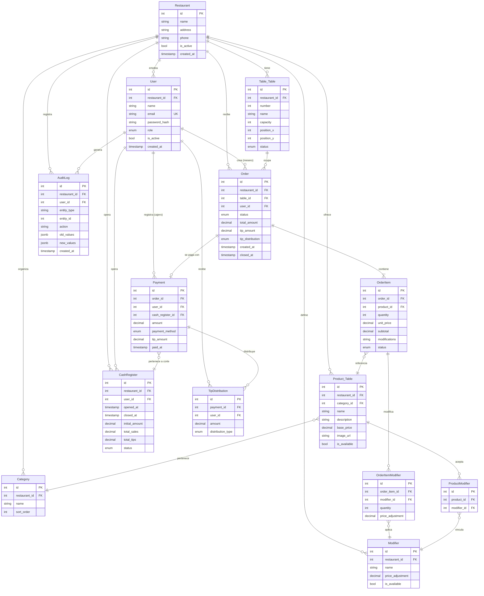

# Modelo de Datos -- SOR

## Modelo Logico (ERD)



---

## Modelo Fisico (PostgreSQL)

### Tipos Enumerados

```sql
CREATE TYPE user_role AS ENUM ('waiter', 'cashier', 'admin', 'superadmin');
CREATE TYPE table_status AS ENUM ('free', 'occupied', 'reserved', 'cleaning');
CREATE TYPE order_status AS ENUM ('draft', 'in_kitchen', 'ready', 'delivered', 'paid', 'partially_paid', 'closed');
CREATE TYPE order_item_status AS ENUM ('pending', 'in_kitchen', 'ready', 'cancelled');
CREATE TYPE payment_method AS ENUM ('cash', 'card', 'transfer');
CREATE TYPE tip_distribution_type AS ENUM ('equal', 'individual');
CREATE TYPE cash_register_status AS ENUM ('open', 'closed');
```

### DDL Principal

```sql
CREATE TABLE restaurants (
    id SERIAL PRIMARY KEY,
    name VARCHAR(100) NOT NULL,
    address VARCHAR(200),
    phone VARCHAR(20),
    is_active BOOLEAN NOT NULL DEFAULT true,
    created_at TIMESTAMPTZ NOT NULL DEFAULT NOW()
);

CREATE TABLE users (
    id SERIAL PRIMARY KEY,
    restaurant_id INTEGER NOT NULL REFERENCES restaurants(id),
    name VARCHAR(100) NOT NULL,
    email VARCHAR(150) NOT NULL UNIQUE,
    password_hash VARCHAR(255) NOT NULL,
    role user_role NOT NULL DEFAULT 'waiter',
    is_active BOOLEAN NOT NULL DEFAULT true,
    created_at TIMESTAMPTZ NOT NULL DEFAULT NOW()
);

CREATE TABLE tables (
    id SERIAL PRIMARY KEY,
    restaurant_id INTEGER NOT NULL REFERENCES restaurants(id),
    number INTEGER NOT NULL,
    name VARCHAR(50),
    capacity INTEGER NOT NULL DEFAULT 4,
    position_x INTEGER DEFAULT 0,
    position_y INTEGER DEFAULT 0,
    status table_status NOT NULL DEFAULT 'free',
    UNIQUE(restaurant_id, number)
);

CREATE TABLE orders (
    id SERIAL PRIMARY KEY,
    restaurant_id INTEGER NOT NULL REFERENCES restaurants(id),
    table_id INTEGER NOT NULL REFERENCES tables(id),
    user_id INTEGER NOT NULL REFERENCES users(id),
    status order_status NOT NULL DEFAULT 'draft',
    total_amount NUMERIC(19,4) NOT NULL DEFAULT 0,
    tip_amount NUMERIC(19,4) DEFAULT 0,
    tip_distribution tip_distribution_type DEFAULT 'equal',
    created_at TIMESTAMPTZ NOT NULL DEFAULT NOW(),
    closed_at TIMESTAMPTZ
);

CREATE TABLE products (
    id SERIAL PRIMARY KEY,
    restaurant_id INTEGER NOT NULL REFERENCES restaurants(id),
    category_id INTEGER REFERENCES categories(id),
    name VARCHAR(100) NOT NULL,
    description TEXT,
    base_price NUMERIC(19,4) NOT NULL CHECK (base_price > 0),
    image_url VARCHAR(500),
    is_available BOOLEAN NOT NULL DEFAULT true
);

CREATE TABLE categories (
    id SERIAL PRIMARY KEY,
    restaurant_id INTEGER NOT NULL REFERENCES restaurants(id),
    name VARCHAR(50) NOT NULL,
    sort_order INTEGER NOT NULL DEFAULT 0
);

CREATE TABLE modifiers (
    id SERIAL PRIMARY KEY,
    restaurant_id INTEGER NOT NULL REFERENCES restaurants(id),
    name VARCHAR(100) NOT NULL,
    price_adjustment NUMERIC(19,4) NOT NULL DEFAULT 0,
    is_available BOOLEAN NOT NULL DEFAULT true
);

CREATE TABLE product_modifiers (
    id SERIAL PRIMARY KEY,
    product_id INTEGER NOT NULL REFERENCES products(id) ON DELETE CASCADE,
    modifier_id INTEGER NOT NULL REFERENCES modifiers(id) ON DELETE CASCADE,
    UNIQUE(product_id, modifier_id)
);

CREATE TABLE order_items (
    id SERIAL PRIMARY KEY,
    order_id INTEGER NOT NULL REFERENCES orders(id) ON DELETE CASCADE,
    product_id INTEGER NOT NULL REFERENCES products(id),
    quantity INTEGER NOT NULL CHECK (quantity > 0),
    unit_price NUMERIC(19,4) NOT NULL,
    subtotal NUMERIC(19,4) NOT NULL,
    modifications TEXT,
    status order_item_status NOT NULL DEFAULT 'pending'
);

CREATE TABLE order_item_modifiers (
    id SERIAL PRIMARY KEY,
    order_item_id INTEGER NOT NULL REFERENCES order_items(id) ON DELETE CASCADE,
    modifier_id INTEGER NOT NULL REFERENCES modifiers(id),
    quantity INTEGER NOT NULL DEFAULT 1,
    price_adjustment NUMERIC(19,4) NOT NULL DEFAULT 0
);

CREATE TABLE cash_registers (
    id SERIAL PRIMARY KEY,
    restaurant_id INTEGER NOT NULL REFERENCES restaurants(id),
    user_id INTEGER NOT NULL REFERENCES users(id),
    opened_at TIMESTAMPTZ NOT NULL DEFAULT NOW(),
    closed_at TIMESTAMPTZ,
    initial_amount NUMERIC(19,4) NOT NULL DEFAULT 0,
    total_sales NUMERIC(19,4) NOT NULL DEFAULT 0,
    total_tips NUMERIC(19,4) NOT NULL DEFAULT 0,
    status cash_register_status NOT NULL DEFAULT 'open'
);

CREATE TABLE payments (
    id SERIAL PRIMARY KEY,
    order_id INTEGER NOT NULL REFERENCES orders(id),
    user_id INTEGER NOT NULL REFERENCES users(id),
    cash_register_id INTEGER NOT NULL REFERENCES cash_registers(id),
    amount NUMERIC(19,4) NOT NULL CHECK (amount > 0),
    payment_method payment_method NOT NULL,
    tip_amount NUMERIC(19,4) NOT NULL DEFAULT 0,
    paid_at TIMESTAMPTZ NOT NULL DEFAULT NOW()
);

CREATE TABLE tip_distributions (
    id SERIAL PRIMARY KEY,
    payment_id INTEGER NOT NULL REFERENCES payments(id) ON DELETE CASCADE,
    user_id INTEGER NOT NULL REFERENCES users(id),
    amount NUMERIC(19,4) NOT NULL,
    distribution_type tip_distribution_type NOT NULL
);

CREATE TABLE audit_logs (
    id SERIAL PRIMARY KEY,
    restaurant_id INTEGER NOT NULL REFERENCES restaurants(id),
    user_id INTEGER NOT NULL REFERENCES users(id),
    entity_type VARCHAR(50) NOT NULL,
    entity_id INTEGER NOT NULL,
    action VARCHAR(50) NOT NULL,
    old_values JSONB,
    new_values JSONB,
    created_at TIMESTAMPTZ NOT NULL DEFAULT NOW()
);
```

---

## Estrategia de Indices

| Tabla | Indice | Columnas | Tipo | Motivo |
|-------|--------|----------|------|--------|
| `users` | `idx_users_email` | `(email)` | B-tree UNIQUE | Login por email |
| `users` | `idx_users_restaurant_role` | `(restaurant_id, role)` | B-tree | Filtrar usuarios por sucursal y rol |
| `orders` | `idx_orders_restaurant_status` | `(restaurant_id, status)` | B-tree | Listar ordenes activas por estado |
| `orders` | `idx_orders_table` | `(table_id)` | B-tree | Buscar orden por mesa |
| `orders` | `idx_orders_user_created` | `(user_id, created_at DESC)` | B-tree | Ordenes por mesero, orden reciente |
| `orders` | `idx_orders_status_kitchen` | `(status, created_at)` WHERE status = 'in_kitchen' | Partial | KDS: solo ordenes en cocina, FIFO |
| `order_items` | `idx_order_items_order` | `(order_id)` | B-tree | JOIN con orders |
| `products` | `idx_products_restaurant_available` | `(restaurant_id, is_available)` | B-tree | Catalogo activo por sucursal |
| `products` | `idx_products_name_search` | USING GIN (to_tsvector('spanish', name)) | GIN | Busqueda full-text en catalogo |
| `payments` | `idx_payments_cash_register` | `(cash_register_id)` | B-tree | Pagos de un corte de caja |
| `payments` | `idx_payments_paid_at` | `(paid_at)` | B-tree | Reportes por fecha |
| `tip_distributions` | `idx_tips_user` | `(user_id, distribution_type)` | B-tree | Reporte de propinas por empleado |
| `audit_logs` | `idx_audit_entity` | `(entity_type, entity_id)` | B-tree | Buscar auditoria de una entidad |
| `audit_logs` | `idx_audit_created` | `(created_at DESC)` | B-tree | Reportes de auditoria por fecha |

---

## Notas de Diseno

- **Moneda:** `NUMERIC(19,4)` para montos (nunca `FLOAT`).
- **Timestamps:** `TIMESTAMPTZ` en todas las fechas para soporte multi-zona horaria futura.
- **Baja logica:** `users.is_active = false` preserva historial de ordenes y pagos.
- **Multi-sucursal preparado:** Todas las tablas principales incluyen `restaurant_id`. En MVP el campo tiene valor fijo (id=1). La FK esta presente desde el dia 1 para evitar migraciones traumaticas.
- **Auditoria:** `audit_logs.old_values` y `new_values` como `JSONB` para flexibilidad sin esquema rigido.
- **Precio historico:** `order_items.unit_price` captura el precio al momento de la orden, no el precio actual del producto. Esto permite cambios de precio sin afectar ordenes pasadas.
